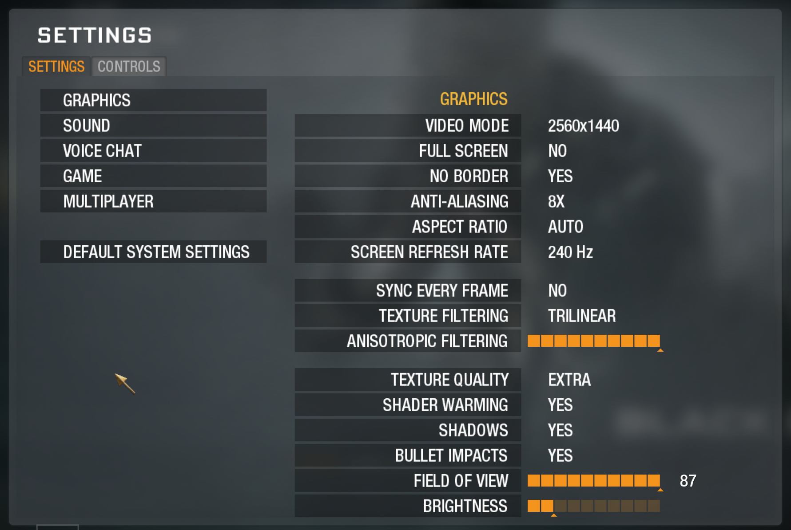
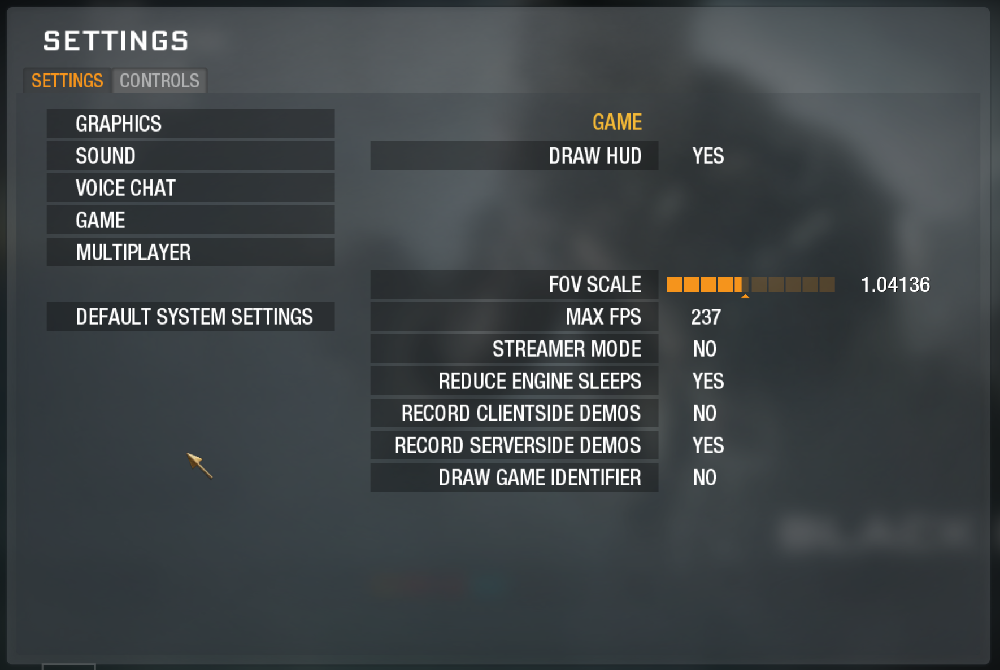
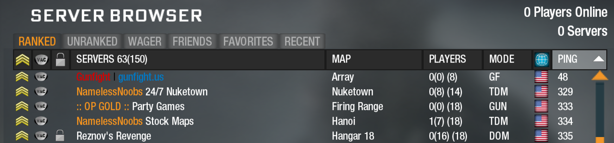

# Black Ops Gunfight - Getting Started

Everything a new player needs: install Plutonium and Black Ops 1, dial in the recommended settings, fix the aim-down-sights bug, and join the Gunfight server. *Part of the [Black Ops Gunfight](../README.md) documentation.*

> Platform: **PC only.** Black Ops Gunfight runs on the [Plutonium](https://plutonium.pw/) T5 client for Call of Duty: Black Ops 1. The **[CB Servers Launcher](https://docs.cbservers.xyz/games/t5)** gets you the game and Plutonium in one app - see [step 1](#1-install-black-ops-1--plutonium).

## Contents
- [1. Install Black Ops 1 + Plutonium](#1-install-black-ops-1--plutonium)
- [2. Recommended settings](#2-recommended-settings)
- [3. Find & join Gunfight](#3-find--join-gunfight)
- [4. Troubleshooting](#4-troubleshooting)

---

## 1. Install Black Ops 1 + Plutonium

Black Ops Gunfight runs on **[Plutonium](https://plutonium.pw/)**, a free community client for Black Ops 1. The **[CB Servers Launcher](https://docs.cbservers.xyz/games/t5)** is the easiest way in - one app downloads Black Ops 1 *and* runs it on the Plutonium client, so there's **no separate Plutonium download**. You'll just need a free **Plutonium account** ([forum.plutonium.pw/register](https://forum.plutonium.pw/register)).

1. **Get the launcher.** Download `cb-launcher.exe` from **[docs.cbservers.xyz/games/t5](https://docs.cbservers.xyz/games/t5)** - their T5 guide has the download and the full walkthrough. Save it anywhere.
2. **Run it.** If Windows SmartScreen shows *"Windows protected your PC"*, click **More info -> Run anyway**.
3. **Open the Library tab** and find **Black Ops**, then click **SETUP**:
   - **Don't own the game?** Choose **Download game** and let it finish (it's a large download).
   - **Already have Black Ops installed?** Point it at your existing copy, then click **VERIFY**.
4. **Log in** with your Plutonium account (create one free at [forum.plutonium.pw/register](https://forum.plutonium.pw/register)).
5. **Click PLAY -> Multiplayer.** Done - CB Servers installed the game and the Plutonium client for you.

> **CB Servers only bundles the download - the client it runs *is* Plutonium**, so everything below (settings, joining gunfight.us) works exactly the same. CB Servers is a third-party launcher, not affiliated with Plutonium.

<!-- image slot: docs/images/getting-started/01-launcher-setup.png (CB Servers Launcher: Library -> Black Ops -> SETUP) -->

---

## 2. Recommended settings

Black Ops is old, but with Plutonium it can be optimized for modern systems. Here are a few critical tweaks to get the game looking sharp and running fast.

### Graphics

| Setting | Recommended |
|---|---|
| Video mode (resolution) | **Highest your display supports** (e.g. `2560x1440` for 2K) |
| Aspect ratio | **Auto** |
| Screen refresh rate | **Highest** (e.g. 144 / 240) |
| No border (borderless fullscreen window) | **Yes** |
| Sync every frame (V-Sync) | **Yes** |
| Anti-Aliasing | **8x** |
| Anisotropic filtering | **16 (max)** |
| Texture filtering | **Trilinear** |
| Texture quality | **Extra** |
| Shader warming | **Yes** |
| Shadows | **Yes** |
| Bullet impacts | **Yes** |
| Field of view | **(see below)** |
| Brightness | **Not too high** |


*In-game Graphics settings - Settings -> Graphics.*

### Field of view (FOV)

The in-game **Field of view** slider maxes out at **80**, but Plutonium lets you push wider by combining it with **FOV scale** (Game tab). Your true FOV is `cg_fov` x `cg_fovScale`, so any scale above 1 takes you past 80. Set both from the in-game **Options** menu (Field of view on the Graphics tab, FOV scale on the Game tab), or type them straight into the console as `cg_fov` and `cg_fovScale`. If you don't want to use this system, just leave **FOV scale** at **1**.

**FOV scale also drives your aim-down-sights (ADS) sensitivity.** Plutonium reworked how `cg_fov` and `cg_fovScale` behave: the vanilla game slows your sensitivity when you aim down sights, but Plutonium now bases it on your FOV scale instead. A few examples (each totalling 90 FOV):

- `cg_fov 90` + `cg_fovScale 1` = 90 FOV. Only your hipfire FOV changes; sensitivity still differs when you zoom in, because the ADS FOV is lower.
- `cg_fov 40` + `cg_fovScale 2.25` = 90 FOV. Your ADS FOV matches your hipfire FOV - more situational awareness at the cost of less zoom detail - so sensitivity is the **same** hipfiring and aiming.
- `cg_fov 70` + `cg_fovScale 1.3` = 90 FOV. ADS is slightly zoomed in versus hipfire, and sensitivity is faster than vanilla because of the higher total FOV.

To work out your total FOV, multiply `cg_fov` by `cg_fovScale` - for a standard **80 FOV**, use `cg_fov 65` and `cg_fovScale 1.32`. Expect to experiment with values to find what feels comfortable.

### How to open the console

Press the **`~`** key (tilde / grave, top-left under **Esc**) to open the Plutonium console. If nothing happens, enable the console in the Plutonium launcher/in-game options first, then press `~` again. Type a command and hit **Enter** - you'll need it for the [Sprint/ADS improvement](#mouse--keyboard-sprintads-improvement) below.

### Game

| Setting | Recommended |
|---|---|
| Draw HUD | **Yes** |
| FOV scale | **(see above)** |
| Max FPS | **Highest** (e.g. 144 / 240) |
| Reduce engine sleeps | **Yes** |


*Game settings - Settings -> Game.*

### Multiplayer

| Setting | Recommended |
|---|---|
| Allow downloading | **Yes** *(needed to auto-download the mod)* |

> **Allow downloading must be on.** It lets Plutonium fetch the Gunfight mod from the server automatically when you join (FastDL) - no manual install.

### Controller

- **Controls -> Gamepad -> Yes** to enable controller support.
- If you are using a PlayStation controller, use **[DS4Windows](https://ds4-windows.com/)** to present it as an Xbox controller.

### Mouse & Keyboard: Sprint/ADS improvement

Black Ops 1 has a long-standing quirk: **you can't aim down sights while the Sprint key (Shift) is held.** Normally you have to fully release Shift before you can aim - which loses gunfights. One console command fixes it.

Open the console (**`~`**) and paste:

```
bind MOUSE2 "+speed_throw; -breath_sprint; -sprint"
```

Now you can **ADS without releasing Sprint.** What it does: aiming (`+speed_throw`) also clears the sprint input (`-breath_sprint`) so the engine stops blocking your aim. The trailing `-sprint` is a required no-op - it absorbs the key event so the sprint release actually fires.

The game sometimes strips custom `MOUSE2` binds on restart. If ADS goes dead, just **re-paste the line**.

---

## 3. Find & join Gunfight

Black Ops Gunfight is a ranked server. Join through the in-game **Server Browser**.

1. Launch the game via the Plutonium launcher.
2. Open the **Server Browser** under **PLAY**.
3. **Reset the filters** and click **Refresh** so every server shows (modded servers are hidden by default filters).
4. On the **Ranked** tab, find **`Gunfight | gunfight.us`** (mode **GF**) and join. The mod **downloads automatically** on connect (FastDL) - no manual install needed.

> **First join only:** after the download finishes, the game rebuilds itself around the mod and your screen may go **black for a few minutes**. This is normal - let it finish and it will drop you into the match. Still black after ~5 minutes? Close the game and rejoin: the mod is already downloaded, so the second join is quick. Every join after that is instant.

> Keep your **Plutonium launcher updated** so its build matches the server's - FastDL ships the *mod*, not the engine build. More at **[gunfight.us](https://gunfight.us)** and our **[Discord](https://discord.gg/blackops)**.


*The Server Browser - look for `Gunfight | gunfight.us` (mode GF) on the Ranked tab.*

---

## 4. Troubleshooting

| Problem | Fix |
|---|---|
| **Can't aim down sights** while holding Sprint | Paste the ADS bind from the [Sprint/ADS improvement](#mouse--keyboard-sprintads-improvement) section. |
| **ADS stopped working** after a restart | Re-paste the `bind MOUSE2 ...` line. |
| **Game won't launch / bad install** | In the CB Servers Launcher, open **Black Ops -> SETUP** to re-point or re-download your copy, then click **VERIFY**. |
| **Gunfight isn't in the server list** | Reset all filters, click **Refresh**, and check the **Ranked** tab for `Gunfight | gunfight.us`. |
| **Black screen after the mod downloads** (first join) | Normal on the very first join - the game is rebuilding itself around the mod. Give it a few minutes and it drops you into the match. Still black after ~5 minutes? Close the game and rejoin - the second join is quick. |
| **Error connecting to the server** | Make sure your Plutonium client is up to date, then rejoin. |
| **Controller not detected** | Enable **Controls -> Gamepad -> Yes**; if needed, run **[DS4Windows](https://ds4-windows.com/)**. |

---

*Made by KL9. Questions or bugs? Ping us on [Discord](https://discord.gg/blackops).*
