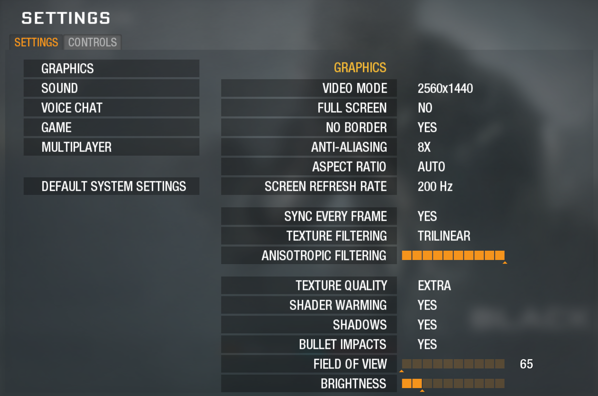
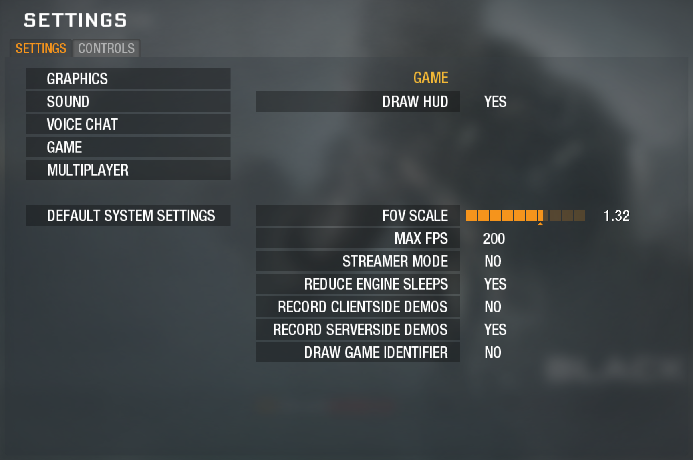

[<- Black Ops Gunfight](../README.md)

# Getting Started

*Install - settings - joining the server*

Black Ops Gunfight runs on [Plutonium](https://plutonium.pw/) for T5 (Call of Duty: Black Ops 1). The open source [CB Servers Launcher](https://github.com/CBServers/cb-launcher) gets you the game for free and Plutonium in one app. You'll need a free [Plutonium account](https://forum.plutonium.pw/register) to play.

## On this page

1. [Install](#1-install)
2. [Recommended settings](#2-recommended-settings)
3. [Find & join Gunfight](#3-find--join-gunfight)
4. [Troubleshooting](#4-troubleshooting)

---

## 1. Install

The [CB Servers Launcher](https://github.com/CBServers/cb-launcher) includes everything you need to start playing for free.

1. **Get the launcher.** Download `cb-launcher.exe` from [github.com/CBServers/cb-launcher](https://github.com/CBServers/cb-launcher).
2. **Run it.** If Windows SmartScreen shows *"Windows protected your PC"*, click **More info -> Run anyway**.
3. **Open the Library tab** and find **Black Ops**, then click **SETUP**. Choose **Download game** and let it finish.
4. **Log in** with your Plutonium account (create one free at [forum.plutonium.pw/register](https://forum.plutonium.pw/register)).
5. **Click PLAY -> Multiplayer -> Server Browser -> [Gunfight](#3-find--join-gunfight)**

> With Black Ops installed, you can open it with either [CB Launcher](https://github.com/CBServers/cb-launcher) or directly through [Plutonium](https://plutonium.pw/docs/install/#plutonium-launcher).

<!-- image slot: docs/images/getting-started/01-launcher-setup.png (CB Servers Launcher: Library -> Black Ops -> SETUP) -->

---

## 2. Recommended settings

Black Ops can be optimized for modern systems. Here are a few critical tweaks to get the game looking sharp and running fast.

### Graphics

| Setting | Recommended |
|---|---|
| Video mode (resolution) | **Highest your display supports** (e.g. 2560x1440 for 2K) |
| Aspect ratio | **Auto** |
| Screen refresh rate | **Highest** (e.g. 144 / 240) |
| No border (borderless fullscreen window) | **Yes** |
| Sync every frame (V-Sync) | **Yes** |
| Anti-Aliasing | **8x** |
| Anisotropic filtering | **16** (max) |
| Texture filtering | **Trilinear** |
| Texture quality | **Extra** |
| Shader warming | **Yes** |
| Shadows | **Yes** |
| Bullet impacts | **Yes** |
| Field of view | **65** (see below for higher **FOV scale**) |
| Brightness | **Not too high** |


*Graphics settings - Settings -> Graphics.*

### Field of view (FOV)

The in-game **Field of view** slider caps at **80**, but Plutonium lets you go wider using **FOV scale** (Game tab) alongside **Field of view** (Graphics tab). To work out your total FOV, multiply `cg_fov` by `cg_fovScale`; any scale above 1 pushes past 80. Set both from the in-game **Options** menu, or directly via [console](#how-to-open-the-console) (`cg_fov`, `cg_fovScale`).

**FOV scale also affects your ADS sensitivity.** Examples totalling **90** FOV:

- `cg_fov 90` + `cg_fovScale 1`: only hipfire widens, so ADS still feels slower.
- `cg_fov 40` + `cg_fovScale 2.25`: ADS FOV matches hipfire, so sensitivity never changes.
- `cg_fov 70` + `cg_fovScale 1.3`: ADS zooms in slightly; sensitivity faster than vanilla.

### Game

| Setting | Recommended |
|---|---|
| Draw HUD | **Yes** |
| FOV scale | **(see above)** |
| Max FPS | **Highest** (e.g. 144 / 240) |
| Reduce engine sleeps | **Yes** |


*Game settings - Settings -> Game.*

### Controller

- **Controls -> Gamepad -> Yes** to enable controller support.
- If you are using a PlayStation controller, use [DS4Windows](https://ds4-windows.com/) to present it as an Xbox controller.

### How to open the console

Press the `~` key (tilde / grave, top-left under **Esc**) to open the Plutonium console. If nothing happens, enable the console in the Plutonium launcher/in-game options first, then press `~` again. Type a command and hit **Enter** - you'll need it for the [Sprint/ADS improvement](#mouse--keyboard-sprintads-improvement) below.

### Mouse & Keyboard: Sprint/ADS improvement

Black Ops 1 has a long-standing quirk: **you can't aim down sights while the Sprint key (Shift) is held.** Normally you have to fully release Shift before you can aim - which loses gunfights. One [console](#how-to-open-the-console) command fixes it.

Open the [console](#how-to-open-the-console) (`~`) and paste:

```
bind MOUSE2 "+speed_throw; -breath_sprint; -sprint"
```

Now you can **ADS without releasing Sprint.** What it does: aiming (`+speed_throw`) also clears the sprint input (`-breath_sprint`) so the engine stops blocking your aim. The trailing `-sprint` is a required no-op - it absorbs the key event so the sprint release actually fires.

The game sometimes strips custom `MOUSE2` binds on restart. If ADS goes dead, just **re-paste the line**.

### Recommended console commands

An **alternate way to apply your settings** - most of these have an in-game menu equivalent (Graphics / Game tabs), but a few have no menu entry at all. Open the [console](#how-to-open-the-console) (`~`) and paste the block. `seta` both applies a setting **and saves it**, so you only paste once and it sticks across restarts.

```
seta com_maxfps          "144"     // frame cap (also Options -> Game -> Max FPS)
seta r_displayRefresh    "144 Hz"  // Match your monitors output Hz
seta cl_maxpackets       "100"     // stock 30; lowers input latency
seta com_reduceSleep     "1"       // Options -> Game -> Reduce engine sleeps
seta r_aaSamples         "8"       // anti-aliasing (8x)
seta r_texFilterAnisoMax "16"      // anisotropic filtering (max)
seta r_picmip            "0"       // texture quality: Extra
seta sm_enable           "1"       // shadows on
seta cg_fov              "65"      // base FOV (true FOV = cg_fov x cg_fovScale)
seta cg_fovScale         "1.30"    // 65 x 1.30 = ~85 total; also drives ADS sensitivity
seta gpad_enabled        "1"       // controller support
```

**Or apply all of them at once.** Paste this single line into the [console](#how-to-open-the-console) and hit **Enter**:

```
seta com_maxfps 144;seta r_displayRefresh "144 Hz";seta cl_maxpackets 100;seta com_reduceSleep 1;seta r_aaSamples 8;seta r_texFilterAnisoMax 16;seta r_picmip 0;seta sm_enable 1;seta cg_fov 65;seta cg_fovScale 1.30;seta gpad_enabled 1;vid_restart
```

---

## 3. Find & join Gunfight

Black Ops Gunfight is a ranked server. Join through the in-game **Server Browser**.

1. Launch the game with either [CB Launcher](https://github.com/CBServers/cb-launcher) or directly through [Plutonium](https://plutonium.pw/docs/install/#plutonium-launcher).
2. Click **PLAY** and open the **Server Browser**.
3. On the **Ranked** tab, click **refresh** then find `Gunfight [gunfight.us]` (mode **GF**) and join.

> The screen may go black for a moment as the game does a quick restart before connecting.

![The Server Browser with Gunfight \[gunfight.us\] in the Ranked tab](images/getting-started/server-browser.png)
*The Server Browser - look for `Gunfight [gunfight.us]` on the **Ranked** tab.*

> Keep your **Plutonium launcher updated** so its build matches the server's. Questions? Join our [Discord](https://discord.gg/blackops).

---

## 4. Troubleshooting

| Problem | Fix |
|---|---|
| **Controller not detected** | Enable **Controls -> Gamepad -> Yes** (PlayStation controllers need [DS4Windows](https://ds4-windows.com/) or Steam input). |
| **Can't aim down sights** while holding Sprint | Paste the ADS bind from the [Sprint/ADS improvement](#mouse--keyboard-sprintads-improvement) section. |
| **ADS stopped working** after a restart | Re-paste the [ADS bind](#mouse--keyboard-sprintads-improvement). |
| **FOV or ADS sensitivity feels weird** | See the [Field of view](#field-of-view-fov) section. |
| **Game doesn't feel smooth** | Use full-screen with the [recommended settings](#2-recommended-settings). |
| **Game won't launch / bad install** | In the CB Servers Launcher, open **Black Ops -> SETUP** to re-point or re-download your copy, then click **VERIFY**. |
| **Gunfight isn't in the server list** | Reset all filters, view the **Ranked** tab, and click **Refresh** to find `Gunfight [gunfight.us]`. |
| **Error connecting to the server** | Make sure your Plutonium client is up to date, restart then rejoin. |
| **Settings & Rank reset to defaults** after joining Gunfight | Normal on the very first join. Settings & Rank are saved **per mod**, not per game. Back out to the main menu (the mod stays loaded), apply the [recommended settings](#2-recommended-settings), and rejoin. One-time setup; they stick from then on. You'll rank up fast. |

---

Made by **KL9** - [Discord](https://discord.gg/blackops) - [GitHub](https://github.com/KL9modz/BO1-Gunfight)

*Trademarks used are owned by their respective owners. This mod is not endorsed by or affiliated with the copyright holders of the base game in any form.*
